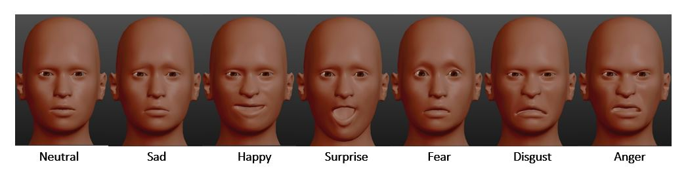
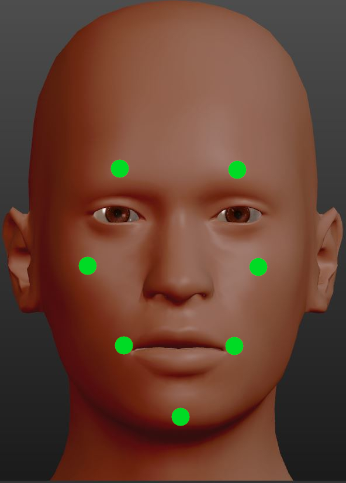

```{r setup, include=FALSE}
#importing packages and doing initial setup
knitr::opts_chunk$set(echo = TRUE)
library(fmsb)
library(prettydoc)
library(gtsummary)
library(ggplot2)
library(tidyverse)
library(corrplot)
library(ggExtra)
library(stringr)
library(ggiraphExtra)
library(ggplot2)
library(ggpubr)
library(formattable)
library(ggradar)
library(faux)
library(reactable)
library(plotly)
suppressPackageStartupMessages(library(dplyr))
library(scales)
library(knitr)
library(broom)
#read first dataset
data <- read.csv("AndBrain_Dataset.csv")
data <- as_tibble(data)
set.seed(1967) #year when the glorious Blue Oyster Cult band was formed
options(digits=5)
options(warn=-1) #disable warnings globally
```

# Introduction

The human face plays an essential role in human communication. However, the ability to convey thoughts and ideas as speech is not the only function it holds. Facial expressions are a paramount aspect in communication as well, as they enable humans not only to transmit emotions in a more fluid way, but also to alter the meaning of spoken sentences[1]. Detecting these expressions is something hardcoded into the human brain. Through associations, humans are able to naturally understand complex sets of information such as intent, mood, sex, age, etc[2]. <br />
However, since the rise of automation and innovations in fields like artificial intelligence and computer vision, algorithms capable of understanding social cues and facial expressions have seen an increased demand. <br />
Previous studies have determined two ways of tackling the problem of detecting expressions from image data: feature-based or template-based detection[3]. The first method uses landmarks for image segmentation. Features such as eyes and cheeks are detected in images and their relative position is computed[3]. Alternatively, template-based detection uses a standard general model of the human face and compares the input image against it in order to detect the displaced regions in the image and correlate them with certain emotions. For this method, both bidimensional and 3D models of the face can be used. However, in recent studies, an augmented version of a 3D face was used (with underlying facial muscles) in order to detect which muscles are relevant for emotion and which serve a supporting role in communication and basic physiology[3], [4]. <br />
This study aims to explore an emotion modulation technique that links the perceived sentiment of a dataset of words into emotions, and subsequently applies a computational model to calculate the relative positions of a set of facial landmarks. This algorithm is intended to be used alongside a humanoid robot with actuated synthetic skin. Essentially, this study provides a basic understanding of the expressions a robot should exert when speaking. 
Two datasets were used in this report. The first one, “Emotions sensor dataset” (AndBrain.csv) is a collection of 1104 English words classified statistically into 7 basic human emotions: Disgust, Surprise, Anger, Sadness, Neutral, Happiness, Fear.  The second dataset was created manually and consists of approximate positions of 7 facial landmarks that can be manipulated to obtain the 7 basic facial expressions described in the first dataset.  <br />
 


# Exploration of initial sentiment data

Exploring the word emotion dataset, it can be observed that each word in the dataset has a numeric result associated with each emotion. The table below shows the dataset. <br />
```{r, echo=FALSE, fig.height=40, fig.width=40}
reactable(data, compact = TRUE, wrap=FALSE)
```
The summary of this dataset unveiled that the numeric results are not consistent between emotions. The table below shows that there is no fixed maximum for the expressions recorded. Therefore, a classic normalization technique was employed in order to bring all the values from each expression in a range between 0 and 1. This procedure would enable the code to interpret the numerical values as percentages in the following computation steps. <br />
The normalization formula used was the following:  <br /><br />
$n_{normalized} = (n - range_{min}) * (bound_{max} - bound_{min})/(range_{max} - range_{min}) + bound_{min}$,
where $bound_{min} = 0, bound_{max} = 1$ , $range_{min}$ and $range_{max}$ _are the minimum and maximum values of the numerical vector passed to the function_<br /><br />
The summary of the initial data is:
```{r, echo = FALSE}
summary(data.frame(data))
```
The normalized data then becomes: <br />
```{r, echo=FALSE}
#function to normalise all values in the dataset between 0 and 1
normalize <- function(vector, out_min, out_max){
  in_min <- min(vector)#compute minimum on each column 
  in_max <- max(vector)#compute maximum on each column
  vector <- (vector - in_min) * (out_max - out_min) / (in_max - in_min) + out_min #classic normalisation formula
}
#starting normalization of each column
for(i in 2:8){ #iterate over each expression column (need to do it step by step to ensure that the expressions are normalised independently)
  data[i] <- normalize(data[i],0.0,1.0)
}
summary(data.frame(data)) #provide summary to compare to previous state of the dataset
```


## Analysing extremes
Next, to understand better how the expressions associated with each word are represented and how an emotion functions relative to another, the first 8 words with maximum expressions were considered. The figure below showcases 8 radar plots (1 for each word with a specific maximum and one plot containing all the selected extreme words). <br />

```{r, echo=FALSE, fig.height=50, fig.width= 50}
#function to return a ggplot (radar plot) of a single maximum word  
psy_plot <- function(word_profile, color){
  ggradar(word_profile, group.point.size = 4, axis.label.size=13, grid.label.size = 10, axis.label.offset = 1.2, group.colours = color)
}

#find the first maximum for each expression in the word dataset
most_surprise <- which.max(data$surprise)
most_neutral <- which.max(data$neutral)
most_anger <- which.max(data$anger)
most_sad <- which.max(data$sad)
most_happy <- which.max(data$happy)
most_fear <- which.max(data$fear)
most_disgust <- which.max(data$disgust)

#set title and subtitle sizes
title_size = 40
subtitle_size = 40

#make separate plots for each extreme word (with different colors)

m1=psy_plot(data[most_fear,1:8],rgb(0,0,0.8,0.8)) +
  ggtitle("Fear",subtitle = as.character(data$word[most_fear])) + 
  theme(plot.title = element_text(size= title_size, face = "bold") , plot.subtitle = element_text(size=subtitle_size))

m2=psy_plot(data[most_disgust,1:8],rgb(0.95,0.25,0,0.9)) + 
  ggtitle("Disgust",subtitle = as.character(data$word[most_disgust])) + 
  theme(plot.title = element_text(size= title_size, face = "bold") , plot.subtitle = element_text(size=subtitle_size))

m3=psy_plot(data[most_sad,1:8],rgb(0.5,0.5,0.5,0.8)) +
  ggtitle("Sadness",subtitle = as.character(data$word[most_sad])) + 
  theme(plot.title = element_text(size= title_size, face = "bold") , plot.subtitle = element_text(size=subtitle_size))

m4=psy_plot(data[most_happy,1:8],rgb(0.8,0.1,0.8,0.8)) + 
  ggtitle("Happiness",subtitle = as.character(data$word[most_happy])) + 
  theme(plot.title = element_text(size= title_size, face = "bold") , plot.subtitle = element_text(size=subtitle_size))

m5=psy_plot(data[most_neutral,1:8],rgb(0.5,0.5,0.5,0.8))+
  ggtitle("Neutral",subtitle = as.character(data$word[most_neutral])) + 
  theme(plot.title = element_text(size= title_size, face = "bold") , plot.subtitle = element_text(size=subtitle_size))

m6=psy_plot(data[most_anger,1:8],rgb(0.8,0.2,0.5,0.8)) +
  ggtitle("Anger",subtitle = as.character(data$word[most_anger])) + 
  theme(plot.title = element_text(size= title_size, face = "bold") , plot.subtitle = element_text(size=subtitle_size))

m7=psy_plot(data[most_surprise,1:8],rgb(0.8,0.2,0.5,0.8)) +
  ggtitle("Surprise",subtitle = as.character(data$word[most_surprise])) + 
  theme(plot.title = element_text(size= title_size, face = "bold") , plot.subtitle = element_text(size=subtitle_size))


#create table with the extreme words 
extreme_words<-tibble(data[most_disgust,1:8]) %>% 
  add_row(data[most_surprise,1:8], .name_repair="unique") %>%
  add_row(data[most_neutral,1:8], .name_repair="unique") %>%
  add_row(data[most_anger,1:8], .name_repair="unique") %>%
  add_row(data[most_sad,1:8], .name_repair="unique") %>%
  add_row(data[most_happy,1:8], .name_repair="unique") %>%
  add_row(data[most_fear,1:8], .name_repair="unique")

#get numeric values only from extreme words table
numeric_rows <- extreme_words %>% select(2:8)
#need to add row of average of expressions of each extreme word to provide additional insight into the data 
row_averages <- tibble(Average = rowMeans(numeric_rows))

#make radarplot with all the extreme words to show polarity better
m8 <- ggradar(extreme_words,group.point.size=8,axis.label.size=13, grid.label.size = 10, axis.label.offset = 1.2,legend.text.size = 35  )+
  ggtitle("All extremes") + 
  theme(plot.title = element_text(size= title_size, face = "bold"))

#arrange the figures and annotate entire plot array
extremes <- ggarrange(m1,m2,m3,m4,m5,m6,m7, m8, ncol=4, nrow=2)

annotate_figure(extremes, top = text_grob("Most extreme word for each mood", face = "bold", size = 44))

```
It can easily be observed that expressions such as anger, surprise and fear are highly polarized, while expressions such as neutral and sadness, have high values for a second expression as well. The plots in the figure above provide substantial insight into the way humans understand and interpret language. For example, the word accuracy has the highest **neutral** score (1.0), but a very high **surprise** score as well (0.79). It can be stipulated that oftentimes the lack of polarity in language understanding can be due to subjectivity (a certain word can represent different concepts for different people). It is important to take into account this difference in word perception when computing the kinematics of a robot face, to account for any possible interpretation given to the words transmitted by the robot.<br /> 
Additionally, the plots presented show that humans tend to be more ambivalent towards neutral and surprised emotions and have a clearer perception mechanism over more extreme states (positive or negative), such as anger, disgust or happiness. <br />

```{r, echo=FALSE}
#bind previously computed averages to the extreme words table 
extreme_words <- cbind(extreme_words, row_averages)

#format resulting table with colors to easily identify maxima for each word
#also show averages column as progress bar for an easier read
formattable(extreme_words, align = c("l", rep("c",NCOL(extreme_words)-2),"r"), list('Average' = color_bar("#4DF081"), area(col = 2:8)~ color_tile("green", "red")))
```
Observing the data in the table above, it can be seen that “accuracy” and “acid” have a dominant expression and a second relatively high expression. This could be due to the two moods being confused by the people tested, or could represent that the two expressions are correlated. <br />
Hence, the relationship between **neutral** and **sad** and between **neutral** and **surprise** can be tested further to gain additional information between a typical person’s perception regarding these expressions. <br />
Firstly, a series of Welch two-sample T-Tests were performed, assuming non-paired samples and confidence interval of 95%. <br />
Null Hypothesis: The means of the two emotions tested are equal, i.e $\mu_{1} - \mu_{2} = 0$. <br />
Alternate Hypothesis: The means of the two emotions tested are not equal. <br />
The p-value is the probability that the difference between the sample means is at least as large as what has been observed, under the assumption that the population means are equal. The smaller the p-value, the lower the probability of observing a difference in sample means. Therefore, the smaller the p-value, the stronger the evidence is that the two populations have different means.


```{r, echo=FALSE}
#need t-test between surprise and neutral; and neutral and sad to prove that they are actually independent -> this is also a special case of a general linear model
alpha <- 0.05 #significance level to compare against p values of ttest
t1 <- t.test(data$neutral, data$surprise,conf=0.95, paired=FALSE)
t2 <- t.test(data$sad, data$neutral, conf=0.95, paired=FALSE)
sprintf("T-test between neutral and surprise: %f , alpha = 0.05",t1$p.value)
sprintf("T-test between neutral and sad: %f , alpha = 0.05", t2$p.value)

```
Since both the p-values are larger than the significance level, the Null Hypothesis is accepted. <br />
Next, a correlation test over all the expressions is performed, providing additional insight into the data collected. 
```{r, echo=FALSE}
x <- cor(data[,2:8])

formattable(as.data.frame(x), align = rep("c",7), list(area(col=1:7)~color_tile("green", "red")))
```
It can be observed from the correlation table that the **neutral and disgust, neutral and surprise, neutral and sad and neutral and fear** are highly correlated, while there is no clear correlation coefficient between the other expressions.<br />
This correlation between moods can be attributed to subjectivity in the people tested and a different understanding/experience with certain words. Additionally, it can be clearly observed that neutral is the only emotion with consistently high correlation coefficients, thus demonstrating that personal prefference represents a significant factor when expressing emotions through speech.  

# Action sets for each expression 
In order to modulate robotic facial expressions, certain actuation points on the face must be set. Hence, quantifying facial expressions was done after studying the 7 moods depicted in the “Emotion sensor dataset”. The figure below shows an overview of these moods. The 3D facial expressions used in this study were generated using a 3D modelling and rigging software (Blender + the makehuman plugin).  <br />
 <br />

The expression kinematics were used to create a simplified theoretical model, able to manipulate key facial points in order to achieve the 7 basic emotions. The facial landmarks were chosen visually, based on the areas where the most movement was observed. <br />
Therefore the landmarks were: * eyebrows - pair, cheeks - pair, mouth extremities - pair, Menton point - singular. The Menton point lays in the mandibular plane and in the context of this study it is used to describe whether the mouth is open and if so by how much. A visual representation of these points can be seen in the figure below.<br />

 <br />


Each landmark’s position is defined only on the vertical axis in this study, and the available positions a landmark can take are between -0.5 to 0.5. <br /><br />
$Z_{coord_{landmark}}  \in [-0.5, 0.5].$ <br /><br />
The landmark positions need to be centered around 0. As a default, the _neutral_ emotion sets all the landmarks to a position of 0.  A positive value for a specific landmark corresponds to a raised position, while a negative value corresponds to a lowered position, *relative to the _neutral_ emotion coordinates*. The numerical values of the positions can be observed in the table below:<br />
 
```{r, echo=FALSE}
action_set<- read.csv("action_set.csv",fileEncoding="UTF-8-BOM")
formattable(action_set, align=c(rep("c",8)))
```
Since each word is described proportionally by all the 7 basic emotions, the facial expression outputted by a robotic face should account for all the moods as well. The facial kinematics can be represented, at its most basic level, as a sum of products between a word’s emotional coefficient and that pure emotion’s landmark positions. However, through addition, the landmark positions could be ran out of bounds. A solution to this problem is representing the final landmarks as a weighted average of the positions (with the weights being the original word emotional coefficient). The basic mathematical expression of the weighted average can be seen below: <br /><br />
$\bar{x} = \frac{\sum_{i=1}^{i=n}w_{i}*x_{i}}{\sum_{i=1}^{i=n}w_{i}}$ <br /><br />
Generally, the weighted average is a monotonic expression – it preserves the original trend of the motion.<br />
Hence, mathematically describing the landmark positions as an average for a specific word, would preserve proportionality between all the numerical values of that word’s emotion coefficients. <br /> However, since all the coefficients of the “Emotion Sensor Dataset” are positive, and the landmark positions vary between -0.5 to 0.5 and are centered around 0, the processed landmark positions will tend towards 0. A possible solution to this problem is rescaling the final weighted average with a constant coefficient that would ensure values are contained between the preset bounds. Through experimentation, this constant correction coefficient was chosen to be: <br /><br />
$\alpha = 7$  <br /><br />
Finally, a full dataset was created by binding the word dataset to the adjusted landmark positions for each word. The table below showcases the final dataset, which can be used to modulate emotions in speech. <br />


```{r, echo = FALSE}
get_actual_actions <- function(i){ #define function to compute adjusted landmark positions 
  
  word_parameters<-all_moods_numeric[i,] #get only the numerical part
  
  singular_result <- tibble(word_parameters$neutral * action_set["neutral",] %>%
                     add_row(word_parameters$happy * action_set["happy",]) %>%
                     add_row(word_parameters$sad * action_set["sad",]) %>%
                     add_row(word_parameters$surprise * action_set["surprise",]) %>%
                     add_row(word_parameters$fear * action_set["fear",]) %>%
                     add_row(word_parameters$disgust * action_set["disgust",]) %>%
                     add_row(word_parameters$anger * action_set["anger",]))
#singular result is a table containing all landmark positions, proportional to the score in the word dataset                     
final_result<-tibble(Eyebrow_1=weighted.mean(singular_result$Eyebrow_1, word_parameters),
                Eyebrow_2=weighted.mean(singular_result$Eyebrow_2, word_parameters),
                Cheekbone_1=weighted.mean(singular_result$Cheekbone_1, word_parameters),
                Cheekbone_2=weighted.mean(singular_result$Cheekbone_2, word_parameters),
                Mouth_corner_1=weighted.mean(singular_result$Mouth_corner_1, word_parameters),
                Mouth_corner_2=weighted.mean(singular_result$Mouth_corner_2, word_parameters),
                Menton=weighted.mean(singular_result$Menton, word_parameters))
#final result is a table containing the final position of each landmark on the face, obtained through a weighted average between all the landmark positions and all the mood scores
#the values will converge towards 0 but will hold proportionality so a constant multiplication to rescale them is necessary. 550 was  found to be an apppropriate value
return(as.data.frame(correction_constant *final_result))  #recast as dataframe for an easier time appending results in for loop 
}

correction_constant <- 6 #correction coefficient
rownames<-c("neutral","happy","sad","surprise","fear","disgust","anger") #Define expression order to change row names 
row.names(action_set) <- rownames #get rid of row numbering for a more understandable code
action_set<- action_set[-c(1)] #drop expression name as I have already changed names of rows

#need to determine the dominant mood
all_moods_numeric <- data %>% select(2:8) #select from word dataset only numerical columns 
maxima <- tibble(Expression = colnames(all_moods_numeric)[max.col(all_moods_numeric,ties.method="first")]) #find dominant mood for each word
data_extended <- cbind(data, maxima) #show in  dataset dominant mood

#define empty table of landmarks positions -> will be filled usign the get_actual_functions() function
computed_actions<- tibble(Eyebrow_1=NA,Eyebrow_2=NA,Cheekbone_1=NA,Cheekbone_2=NA, Mouth_corner_1=NA, Mouth_corner_2=NA, Menton=NA)
  

#now iterate over all the rows in the word dataset
for(i in 1:nrow(all_moods_numeric)){
  computed_actions<- rbind(computed_actions, get_actual_actions(i)) #append each result row to empty table 
}

computed_actions<- computed_actions[-1,] #drop NA line which is first line in the computed actions dataset

#define full dataset which contains all the words, the dominant expression and the resulting face landmark positions, for a bird's eye view of the entire study
full_dataset<- cbind(as.data.frame(data_extended), computed_actions)
#show overall format of the  table created
reactable(full_dataset,wrap=FALSE, resizable = TRUE, compact=T)
```


# Analysis of simple sentences and validation of results

Modulating a robot’s facial expressions during a conversation with a user can greatly improve on the user’s empathic reception of the robot[5]. It is important that the expression of the robot matches the expected one from the user[2]. In order to test this, a random sentence was generated. At this stage, this sentence does not need to make any kind of sense, but it should be constructed in a simple enough manner. Arbitrarily, the construction was chosen to be the following:<br /> 
**The _[random word]_ is _[second random word]_ and _[third random word]_.**<br />
 Since the random words are chosen from the dataset, anything can happen to the overall valence of the sentence, therefore, this aspect was disregarded for the sake of result validation accuracy. It is also important to note that prepositions, simple verbs and articles are not present in the dataset and they generally do not hold any emotion -- they are simply used to create and structure sentences. Therefore, words such as "the", "and", "is" are assigned the "neutral" emotion by default. 
<br />
<br />
```{r, echo=FALSE}
#generate 3 random numbers that will be the 
rand1<- runif(1,1,1104)
rand2<- runif(1,1,1104)
rand3<- runif(1,1,1104)
```
**Random sentence: The `r data$word[rand1]` is `r data$word[rand2]` and `r data$word[rand3]`.** <br />


```{r, echo = FALSE}
#get random words from the full_dataset and show time-series data 
sentence <- c("The", data$word[rand1], "is", data$word[rand2], "and", data$word[rand3])
dominant_mood_sequence<-c()
landmark_sequence<- tibble(Eyebrow_1=NA,Eyebrow_2=NA,Cheekbone_1=NA,Cheekbone_2=NA, Mouth_corner_1=NA, Mouth_corner_2=NA, Menton=NA)
i=1
for (i in 1:length(sentence)){
  if (is_empty(full_dataset$word[which(full_dataset == sentence[i])])){#if that word does not exist
  
    dominant_mood_sequence<-c(dominant_mood_sequence, as.character("neutral") )
  #assume that is neutral so that the face can remain overall neutral -> would not affect overall emotion
    landmark_sequence <- rbind(landmark_sequence, mutate(action_set[1,]))
 
   } else { 
     #else (if the word exists) then add the dominant mood to the time-series data
    dominant_mood_sequence<-c(dominant_mood_sequence, as.character(full_dataset$Expression[which(full_dataset == sentence[i])]))
    
    landmark_sequence <- rbind(landmark_sequence, mutate(full_dataset[which(full_dataset == sentence[i]),] %>% select(10:16)))
    }
    
}
landmark_sequence <- landmark_sequence[-1,] %>%
                      mutate(Dominant_Mood = matrix(dominant_mood_sequence))
```
Time-series result for the random sentence: `r dominant_mood_sequence` <br />
<br />
<br />
Time series positions of each landmark for the random sentence: <br />
`r formattable(landmark_sequence, align = rep("c",8), list(area(row = c(2,4,6),col=1:7)~color_tile("#DeF7E9", "#71CA97")))` <br />
<br />

# Conclusions 

This study devised a way to compute facial landmark positions in order to modulate emotions from sentences in English. The main application intended for this algorithm is controlling a humanoid robot with a soft-actuated face and making it exert emotions when interacting to a user in order to generate an empathic response. However, sentiment analysis strategies have a wide range of uses, and a similar algorithm could possibly be used to analyse the overall sentiment of news articles and drive a stock trading algorithm based on the computed emotions. Future development of this program could enable it to control a 3D model of a human face in real time and emulate the emotion time-series data and test for quality of user interaction and empathic response. 

# References 
[1]	M. G. Frank, “Facial Expressions,” Int. Encycl. Soc. Behav. Sci., pp. 5230–5234, 2001, doi: 10.1016/b0-08-043076-7/01713-7.<br />
[2]	D. N. Albohn and R. B. Adams, Social Vision: At the Intersection of Vision and Person Perception. Elsevier Inc., 2016.<br />
[3]	N. Alugupally, A. Samal, D. Marx, and S. Bhatia, “Analysis of landmarks in recognition of face expressions,” Pattern Recognit. Image Anal., vol. 21, no. 4, pp. 681–693, 2011, doi: 10.1134/S105466181104002X.<br />
[4]	M. Wang, D. Bradley, S. Zafeiriou, and T. Beeler, “Facial Expression Synthesis using a Global-Local Multilinear Framework,” Comput. Graph. Forum, vol. 39, no. 2, 2020, doi: 10.1111/cgf.13926.<br />
[5]	A. M. Rosenthal-von der Pütten, N. C. Krämer, L. Hoffmann, S. Sobieraj, and S. C. Eimler, “An Experimental Study on Emotional Reactions Towards a Robot,” Int. J. Soc. Robot., vol. 5, no. 1, pp. 17–34, 2013, doi: 10.1007/s12369-012-0173-8.<br />


```{r, echo = FALSE, include=FALSE}
rep("I do not trust R",200)
```


